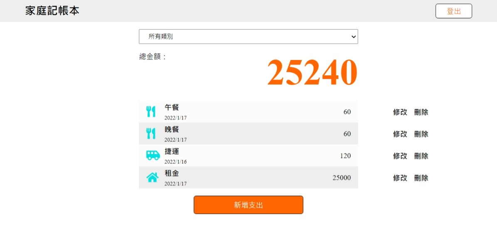

# expense-tracker

##  環境建置與需求 (prerequisites)
*   Node.js
*   MongoDB
##  安裝與執行步驟 (Installation and Execution)
1.  Clone the repository
    ```
    git clone https://github.com/homtele/expense-tracker.git
    ```
2.  Install dependencies
    ```
    cd expense-tracker
    npm install
    ```
3.  Rename `.env.example` to `.env` in the root directory
4.  Seed the data
    ```
    npm run seed
    ```
5.  Run the project
    ```
    npm start
    ```
    Navigate to http://localhost:3000
6.  Register a new account or login the following accounts
    *   email: user1@example.com, password: 12345678
    *   email: user2@example.com, password: 12345678
##  功能描述 (Features)
*   註冊帳號    
    *  註冊之後，可以登入/登出
    *  只有登入狀態的使用者可以看到 app 內容，否則一律被導向登入頁
*   在首頁一次瀏覽所有支出的清單
    *  使用者只能看到自己建立的資料
*   在首頁看到所有支出清單的總金額
*   新增一筆支出
*   編輯支出的屬性
*   刪除任何一筆支出
*   根據「類別」篩選支出
    *   總金額的計算只會包括被篩選出來的支出總和
